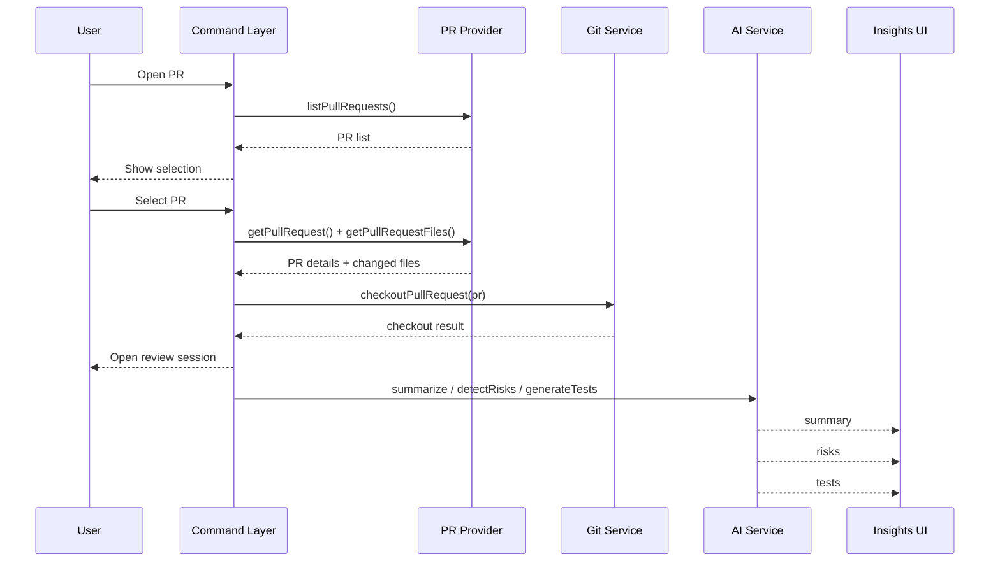

# Technical Architecture

## Purpose

This document describes the technical architecture for the MVP of PR Copilot for VS Code. The design favors a local-first extension model that minimizes backend complexity while preserving a high-quality code review experience inside the IDE.

## Architectural Principles

- Local-first where possible
- Native VS Code experience over custom UI when feasible
- Use checked-out workspace state instead of reconstructing navigation from diffs
- Keep AI advisory, explainable, and non-blocking
- Design service boundaries so a backend can be added later without major rewrites

## System Overview

The MVP is a VS Code extension that connects to GitHub or GitLab, fetches pull request data, checks out the PR branch locally, and uses the checked-out codebase plus language server support for navigation. AI features are invoked directly from the extension using a user-provided API key stored securely in VS Code.

```text
+--------------------------------------------------------------+
|                     VS Code Extension                        |
|                                                              |
|  +----------------+   +----------------+   +---------------+ |
|  | Command Layer  |   | Sidebar / UI   |   | Insights View | |
|  +----------------+   +----------------+   +---------------+ |
|           |                    |                    |        |
|           v                    v                    v        |
|  +--------------------------------------------------------+  |
|  |                    Application Services                |  |
|  |                                                        |  |
|  |  PR Provider   Git Service   Diff Service   AI Client  |  |
|  |                                                        |  |
|  +--------------------------------------------------------+  |
|           |                |                |               |
+-----------|----------------|----------------|---------------+
            |                |                |
            v                v                v
      GitHub/GitLab       Local Git      LLM Provider API
          APIs             Repository      (user key)
                                |
                                v
                      Workspace + Language Server
```

## Major Components

### 1. Extension Entry Point

The entry point registers commands, view providers, and event listeners.

Responsibilities:

- activate extension features
- register commands such as `Open PR`, `Checkout PR`, and `Restore Branch`
- initialize services
- bind UI state to service outputs

Expected file:

- `src/extension.ts`

### 2. Command Layer

The command layer coordinates explicit user actions.

Commands:

- `Open PR`
- `Refresh PRs`
- `Checkout PR`
- `Restore Previous Branch`
- `Generate AI Insights`

Responsibilities:

- invoke services in the correct order
- collect user confirmations where repo state can change
- surface errors and recovery actions cleanly

Expected files:

- `src/commands/openPr.ts`
- `src/commands/checkoutPr.ts`
- `src/commands/restoreBranch.ts`
- `src/commands/refreshReview.ts`

### 3. PR Provider Services

These services integrate with GitHub and GitLab APIs.

Responsibilities:

- authenticate with provider
- fetch repository PR list
- fetch PR metadata
- fetch changed files and patch summaries
- resolve source and target branch information

Interfaces:

- `listPullRequests(repo): Promise<PullRequestSummary[]>`
- `getPullRequest(id): Promise<PullRequestDetails>`
- `getPullRequestFiles(id): Promise<PullRequestFile[]>`

Expected files:

- `src/services/githubService.ts`
- `src/services/gitlabService.ts`

### 4. Git Service

The git service owns local repository state transitions required for review.

Responsibilities:

- detect current branch
- detect uncommitted changes
- fetch PR branches
- checkout PR branch
- restore previous branch after review
- handle common fork fetch strategies

Important behaviors:

- warn before switching on a dirty working tree
- preserve prior branch name for restore
- fail safely if checkout cannot proceed

Interfaces:

- `getCurrentBranch(): Promise<string>`
- `getWorkingTreeStatus(): Promise<WorkingTreeStatus>`
- `checkoutPullRequest(pr): Promise<CheckoutResult>`
- `restorePreviousBranch(): Promise<RestoreResult>`

Expected file:

- `src/services/gitService.ts`

### 5. Diff Service

The diff service translates PR file changes into a reviewable editor experience.

Responsibilities:

- normalize provider file change payloads
- open native VS Code diffs
- support file tree grouping and change metadata
- bridge between PR data and editor state

Approach:

- use provider metadata to identify changed files
- use local checked-out branch state where possible
- compare against base revision or provider patch content as needed

Expected file:

- `src/services/diffService.ts`

### 6. AI Client Service

The AI client service sends review context to the configured LLM provider using the user’s stored API key.

Responsibilities:

- load API key from secure storage
- construct prompts for summary, risks, and tests
- chunk large diffs
- parse model responses into structured outputs
- cache results by PR head SHA where appropriate

Interfaces:

- `summarizePullRequest(input): Promise<SummaryInsight>`
- `detectRisks(input): Promise<RiskInsight[]>`
- `generateTests(input): Promise<TestSuggestion[]>`

Expected file:

- `src/services/aiService.ts`

### 7. Secret Management

Secrets are stored using VS Code secure storage.

Responsibilities:

- store LLM API key
- store provider tokens if needed
- expose read and update helpers

Expected file:

- `src/services/secretService.ts`

### 8. UI Layer

The UI is split across the PR file tree, editor diff experience, and AI insights panel.

Responsibilities:

- render PR list and file tree
- display status, loading states, and errors
- show summary, risks, and test suggestions
- expose actions such as copy, refresh, and restore branch

Expected files:

- `src/providers/prTreeProvider.ts`
- `src/providers/insightsViewProvider.ts`

## Data Model

Suggested core models:

```ts
type PullRequestSummary = {
  id: string;
  title: string;
  author: string;
  sourceBranch: string;
  targetBranch: string;
  updatedAt: string;
  provider: "github" | "gitlab";
};

type PullRequestFile = {
  path: string;
  status: "added" | "modified" | "deleted" | "renamed";
  additions: number;
  deletions: number;
  patch?: string;
};

type ReviewSession = {
  prId: string;
  provider: "github" | "gitlab";
  previousBranch?: string;
  checkedOutBranch?: string;
  headSha?: string;
};

type SummaryInsight = {
  overview: string;
  keyChanges: string[];
  impactedAreas: string[];
};

type RiskInsight = {
  filePath?: string;
  line?: number;
  severity: "low" | "medium" | "high";
  title: string;
  description: string;
};

type TestSuggestion = {
  filePath?: string;
  target?: string;
  scenario: string;
  rationale: string;
};
```

## End-to-End Flows

### Flow 1: Open and Review a PR

1. User runs `Open PR`.
2. Extension determines repository context.
3. Provider service fetches open PRs.
4. User selects a PR from quick pick or sidebar.
5. Extension fetches PR details and changed files.
6. Extension checks working tree state.
7. User confirms checkout if necessary.
8. Git service fetches and checks out the PR branch.
9. PR file tree is populated.
10. User opens diffs and navigates code normally.
11. AI insights run asynchronously and populate the insights panel.

### Flow 2: Generate AI Insights

1. Review session provides PR metadata, file list, and head SHA.
2. AI service collects diff chunks and optional file context.
3. Requests are sent for summary, risks, and test suggestions.
4. Responses are parsed into typed insight objects.
5. Insights panel updates progressively as results arrive.

### Flow 3: Restore Previous Branch

1. User completes or pauses review.
2. User triggers `Restore Previous Branch`.
3. Git service validates working tree safety.
4. Extension switches back to the saved branch.
5. Review session metadata is cleared or archived.

## Sequence Diagram



## VS Code API Usage

Core APIs:

- `commands.registerCommand`
- `window.showQuickPick`
- `window.showWarningMessage`
- `window.createTreeView`
- `TreeDataProvider`
- `SecretStorage`
- `workspace.openTextDocument`
- `commands.executeCommand("vscode.diff", ...)`
- `window.registerWebviewViewProvider`
- `languages.registerCodeLensProvider`
- `window.createTextEditorDecorationType`

Design note:

For MVP, prefer standard VS Code primitives over a highly custom webview-heavy UI. This keeps the extension easier to maintain and makes it feel more native.

## AI Architecture

### Inputs

- PR title and description
- changed file paths
- patch or diff hunks
- optional neighboring code snippets

### Prompt Strategy

Three specialized prompts:

- summary prompt
- risk prompt
- test suggestion prompt

For large PRs:

- chunk diffs by file or hunk
- summarize chunks first
- merge chunk outputs into a top-level result

### Output Strategy

Request structured outputs that can be mapped into UI:

- summary object
- list of risks with optional file or line anchors
- list of test suggestions

### Guardrails

- keep model responses concise
- treat all findings as advisory
- avoid auto-posting comments in MVP
- surface confidence visually if supported later

## State Management

The extension should keep a lightweight in-memory session store for the active review session.

State to track:

- selected PR
- provider type
- changed files
- previous branch
- checked-out branch
- current loading state
- AI insight state
- last analyzed head SHA

Persistence:

- secrets in `SecretStorage`
- lightweight session restore may be added later via `ExtensionContext.workspaceState`

## Error Handling

### Provider Failures

Examples:

- invalid token
- repo not found
- rate limit reached

Handling:

- show actionable errors
- let user retry
- do not break the rest of the extension UI permanently

### Git Failures

Examples:

- dirty working tree
- fetch failure
- checkout conflict
- missing remote permissions

Handling:

- warn before risky operations
- allow cancel
- preserve original branch state whenever possible

### AI Failures

Examples:

- missing API key
- invalid key
- request timeout
- malformed response

Handling:

- do not block review workflow
- show partial results when available
- allow manual retry for each insight type

## Security Considerations

- Store API keys only in VS Code secure storage
- Never log secrets or raw authorization headers
- Avoid sending full repository context unnecessarily
- Send only PR-related code context needed for the requested insight
- Document clearly that AI requests leave the local environment and go to the configured model provider

## Performance Considerations

- Load PR metadata first, then diffs, then AI insights
- Compute AI insights asynchronously
- Cache insight results by PR head SHA
- Limit context size for large PRs
- Support cancellation if user switches PRs mid-analysis

## Repository Structure

```text
src/
  extension.ts
  commands/
    openPr.ts
    checkoutPr.ts
    restoreBranch.ts
    refreshReview.ts
  providers/
    prTreeProvider.ts
    insightsViewProvider.ts
  services/
    githubService.ts
    gitlabService.ts
    gitService.ts
    aiService.ts
    diffService.ts
    secretService.ts
  models/
    pr.ts
    diff.ts
    insight.ts
  utils/
    chunking.ts
    parsing.ts
    workspace.ts
```

## Milestone Mapping

### Milestone 1

- extension scaffold
- provider auth
- PR listing and selection

### Milestone 2

- local branch fetch and checkout
- previous branch restore
- file tree and diff opening

### Milestone 3

- AI summary
- AI risk detection
- insights UI

### Milestone 4

- test suggestions
- test gap heuristics
- caching and performance polish

## Evolution Path

The architecture is intentionally shaped so a backend can be added later for:

- prompt management
- centralized caching
- billing and metering
- team settings
- analytics
- policy enforcement

The cleanest future evolution is to preserve the current `aiService` interface and change only its implementation from direct provider calls to backend API calls.

## Open Technical Questions

- What is the best cross-provider abstraction for GitHub and GitLab PR data?
- Should diffs rely primarily on provider patch data or local git comparisons once checked out?
- How should forked PR fetch behavior be normalized across providers?
- Do we support multiple LLM providers at launch or only one?
- How much session state should persist across VS Code restarts?
